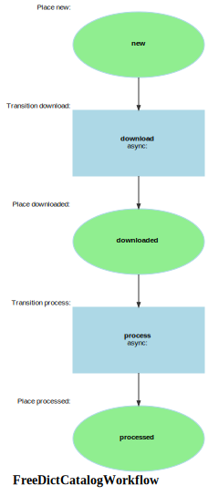

Markdown for FreeDictCatalogWorkflow




---
## Transition: download

### download.Transition

onDownload()
        // 
        // 

```php
    #[AsTransitionListener(WF::WORKFLOW_NAME, WF::TRANSITION_DOWNLOAD)]
    public function onDownload(TransitionEvent $event): void
    {
        $freeDictCatalog = $this->getFreeDictCatalog($event);
        $dict = $this->teiImportService->importTei($freeDictCatalog,
//            truncate: $force,
//            limit: $limit,
            progress: function (int $n) use (&$count) {
                $count = $n;
                if ($n % 1000 === 0) $this->logger->info("Imported $n entries…");
            }
        );
    }
```
[View source](gist/blob/main/src/Workflow/FreeDictCatalogWorkflow.php#L31-L42)


---
## Transition: process

### process.Transition

onProcess()
        // 
        // 

```php
#[AsTransitionListener(WF::WORKFLOW_NAME, WF::TRANSITION_PROCESS)]
public function onProcess(TransitionEvent $event): void
{
    $freeDictCatalog = $this->getFreeDictCatalog($event);
}
```
[View source](gist/blob/main/src/Workflow/FreeDictCatalogWorkflow.php#L46-L49)


